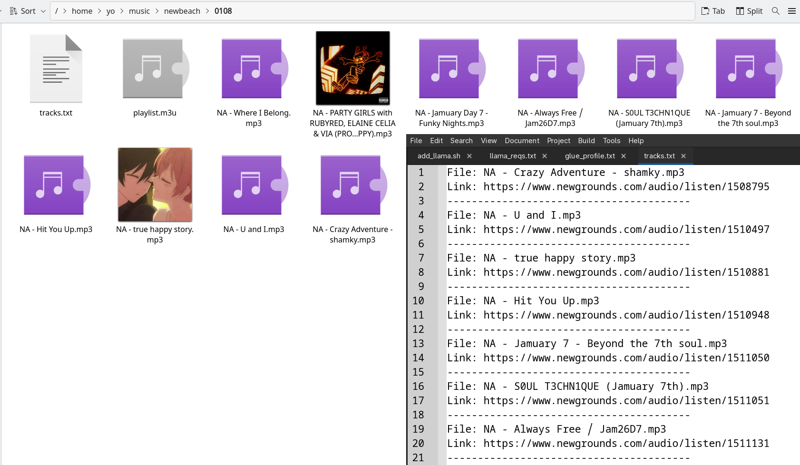
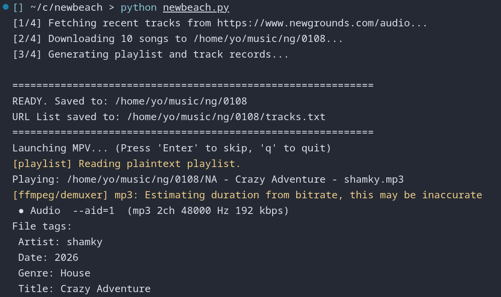

Fetch recent Newgrounds songs

Just run the script. It saves them in ~/music/newbeach/{mmdd}

It includes an m3u playlist file and a text file with song urls.

## Usage recommendation

Run this script once a day.

## Requirements

1) yt-dlp

1) mpv

1) python